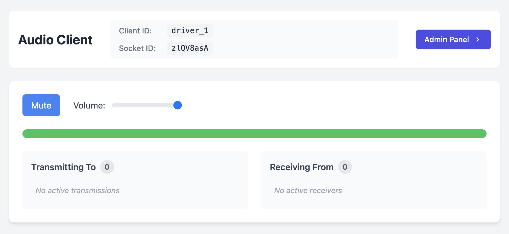
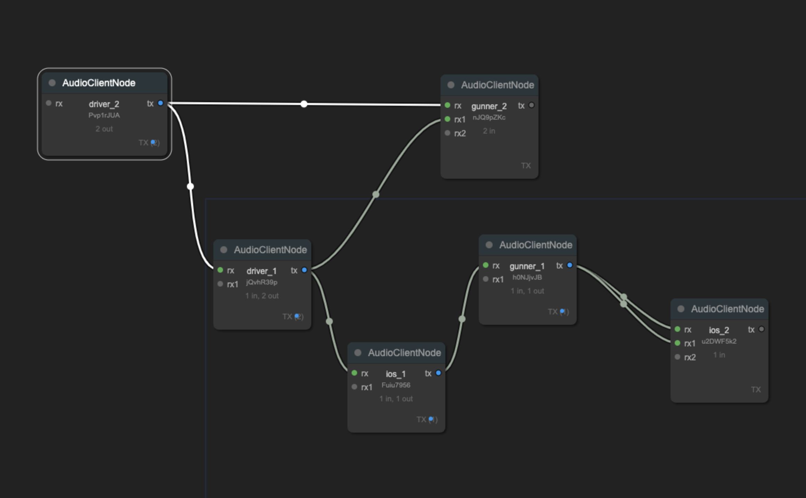

# Switchboard - WebRTC Audio Node System


A real-time audio routing system built with WebRTC, Socket.IO, and Express. This application allows multiple clients to connect and route audio streams between each other through a central admin interface.

## Features

- **Real-time Audio Streaming**: Stream audio between multiple clients using WebRTC
- **Admin Control Panel**: Visual interface for managing audio connections
- **Client Identification**: Custom client names for easy identification
- **Connection Status**: Real-time status updates and connection tracking
- **Modern UI**: Built with Tailwind CSS for a clean, responsive interface

## Prerequisites

- Node.js (v14 or higher)
- npm (v6 or higher)
- Modern web browser with WebRTC support
- SSL certificates for HTTPS (required for WebRTC)

## Installation

1. Clone the repository:
```bash
git clone [repository-url]
cd switchboard
```

2. Install dependencies:
```bash
npm install
```

3. Build the CSS:
```bash
npm run build:css
```

4. Start the server:
```bash
npm start
```

For development with hot CSS reloading:
```bash
npm run watch:css
```

## Usage

### Client Interface

1. Access the client interface:
```
https://localhost:3000
```

2. To connect with a custom client name, use the URL parameter:
```
https://localhost:3000/?id=MyClientName
```

The client interface shows:
- Your client ID
- Your socket ID
- Connection status
- Audio controls


### Admin Interface

1. Access the admin panel:
```
https://localhost:3000/admin
```

Features:
- Visual node-based interface for managing connections
- Drag and drop to create audio routes
- Real-time connection status
- Client name display



## Project Structure

```
switchboard/
├── public/
│   ├── src/
│   │   └── input.css      # Tailwind source CSS
│   ├── admin.html         # Admin interface
│   ├── admin.js           # Admin panel logic
│   ├── client.js          # Client-side WebRTC logic
│   ├── index.html         # Client interface
│   └── style.css          # Compiled CSS
├── server.js              # Express server & Socket.IO logic
├── package.json           # Project dependencies
└── tailwind.config.js     # Tailwind configuration
```

## Scripts

- `npm start`: Start the server
- `npm run start:network`: Start server accessible from network
- `npm run build:css`: Build Tailwind CSS
- `npm run watch:css`: Watch and build CSS in development
- `npm run dev`: Build CSS and start server

## Technical Details

- **WebRTC**: Handles peer-to-peer audio streaming
- **Socket.IO**: Manages signaling and client connections
- **Express**: Serves static files and handles routing
- **Tailwind CSS**: Handles styling and UI components
- **LiteGraph.js**: Powers the admin interface visualization

## Security Notes

- HTTPS is required for WebRTC functionality
- Place your SSL certificates in the project root:
  - `localhost.key`
  - `localhost.crt`

## Development

1. Start the CSS watcher:
```bash
npm run watch:css
```

2. In another terminal, start the server:
```bash
npm start
```

3. Access the application at `https://localhost:3000`

## Contributing

1. Fork the repository
2. Create your feature branch
3. Commit your changes
4. Push to the branch
5. Create a new Pull Request

## License

MIT License. See [LICENSE](LICENSE) for details.
